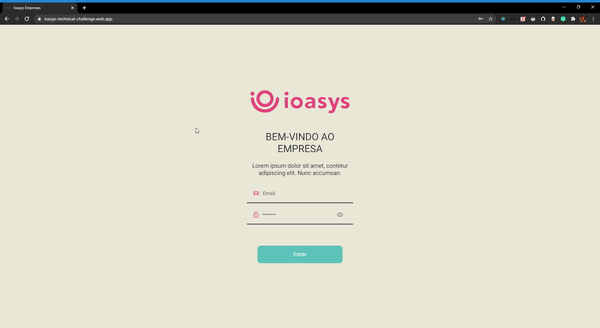

<h3 align="center">
  Desafio Técnico Ioasys
</h3>

  

  

  <a href="">Sobre o projeto</a>&nbsp;&nbsp;&nbsp;|&nbsp;&nbsp;&nbsp;
  <a href="#memo-licença">Licença</a>

 

 

## Sobre

 

Uma aplicação simples de login com autenticação e busca de dados a uma api.

Foi usado como framework o React, e toda a aplicação foi escrita usando typescript

A aplicação em sua grande maioria foi feita seguindo o solicitado no layout do projeto, com exceção da parte da busca, que foi feito um input de forma um pouco diferente, colocado dentro de um formulario, apenas por praticidade e para terminar o desafio em tempo hábil

A aplicação usa em sua maioria hooks, por exemplo, para repassar as informações do usuario e de token que retornam do login, foi usando um useContext para fazer a autenticação e repassar a informação para todos os outros elementos do projeto

A aplicação esta hospedada no **[https://ioasys-technical-challenge.web.app/](https://ioasys-technical-challenge.web.app/)**

Para executar o projeto basta dar um `git clone https://github.com/tiagofsv95/ioasys.git` no seu console e depois `yarn` para instalar as dependencias. Depois de instalar todas as dependencias basta executar `yarn start`.

## :memo: Licença

Esse projeto está sob a licença MIT. Veja o arquivo [LICENSE](LICENSE) para mais detalhes.

---

Feito com ❤️ by Tiago Felipe
